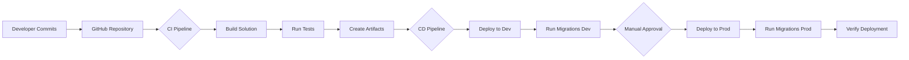

# CI/CD Implementation - Durdans Hospital Clinic Management System

## Table of Contents
1. [Introduction](#introduction)
2. [Architecture](#architecture)
3. [Azure DevOps Implementation](#azure-devops-implementation)
4. [GitHub Actions Implementation](#github-actions-implementation)
5. [Test Projects](#test-projects)
6. [Database Migrations](#database-migrations)
7. [Configuration Management](#configuration-management)
8. [Deployment Process](#deployment-process)
9. [Monitoring & Logging](#monitoring--logging)
10. [Troubleshooting](#troubleshooting)
11. [Appendix](#appendix)

---

## 1. Introduction

### 1.1 CI/CD Goals

The CI/CD implementation for the Durdans Hospital Clinic Management System aims to:

- **Automate Build Process**: Automatically compile and test code on every commit
- **Ensure Quality**: Run automated tests before deployment
- **Streamline Deployments**: Deploy to Dev and Prod environments with minimal manual intervention
- **Database Migrations**: Automatically apply Entity Framework migrations
- **Reduce Errors**: Minimize human error through automation
- **Enable Rapid Iteration**: Allow quick deployment of bug fixes and new features

### 1.2 Benefits

- ✅ **Faster Time to Market**: Automated pipelines reduce deployment time from hours to minutes
- ✅ **Improved Quality**: Automated testing catches bugs before production
- ✅ **Consistency**: Same deployment process every time
- ✅ **Audit Trail**: Complete history of all deployments
- ✅ **Rollback Capability**: Easy to revert to previous versions
- ✅ **Developer Productivity**: Developers focus on code, not deployment logistics

---

## 2. Architecture

### 2.1 Pipeline Flow



### 2.2 Environment Strategy

| Environment | Purpose | Deployment | Database |
|------------|---------|------------|----------|
| **Development** | Testing and QA | Automatic on commit to main | Azure SQL (Dev) |
| **Production** | Live system | Manual approval required | Azure SQL (Prod) |

### 2.3 Technology Stack

- **Source Control**: GitHub
- **CI/CD Options**: Azure DevOps Pipelines OR GitHub Actions
- **Hosting**: Azure App Service (Windows)
- **Database**: Azure SQL Database
- **Migrations**: Entity Framework 6 Code First Migrations
- **Testing**: MSTest with Moq

---

## 3. Azure DevOps Implementation

### 3.1 Build Pipeline (`azure-pipelines-build.yml`)

**Location**: `/azure-pipelines-build.yml`

**Trigger**: Commits to `main` branch

**Key Steps**:
1. **NuGet Restore**: Restores all package dependencies
2. **Build Solution**: Compiles in Release configuration
3. **Run Tests**: Executes all unit and integration tests
4. **Create Web Deploy Package**: Packages application for deployment
5. **Publish Artifacts**: Makes build output available for release pipeline

**Test Execution**:
- Uses VSTest to run all `*Tests.dll` assemblies
- Generates code coverage reports
- Fails pipeline if any tests fail

### 3.2 Release Pipeline (`azure-pipelines-release.yml`)

**Location**: `/azure-pipelines-release.yml`

**Trigger**: Successful completion of build pipeline

#### Stage 1: Development
- **Automatic Deployment**: No approval required
- **Steps**:
  1. Download build artifacts
  2. Deploy to Azure App Service (Dev)
  3. Run EF6 migrations using PowerShell script
  4. Smoke test deployment (HTTP 200 check)

#### Stage 2: Production
- **Manual Approval**: Required via Azure DevOps Environments
- **Steps**:
  1. Backup production database
  2. Download build artifacts
  3. Deploy to Azure App Service (Prod)
  4. Run EF6 migrations
  5. Verify deployment

### 3.3 Variable Groups

**Durdans-Dev**:
- `AzureSubscription`: Service connection name
- `AppServiceName-Dev`: Dev App Service name
- `ResourceGroupName-Dev`: Dev resource group
- `ConnectionString-Dev`: Dev database connection (stored as secret)

**Durdans-Prod**:
- `AzureSubscription`: Service connection name
- `AppServiceName-Prod`: Prod App Service name
- `ResourceGroupName-Prod`: Prod resource group
- `ConnectionString-Prod`: Prod database connection (stored as secret)

---

## 4. GitHub Actions Implementation

### 4.1 Build Workflow (`.github/workflows/build.yml`)

**Trigger**: Push to `main` or pull requests

**Key Steps**:
1. Checkout code
2. Setup MSBuild and NuGet
3. Restore packages
4. Build solution
5. Run tests with VSTest
6. Upload artifacts

**Advantages**:
- Integrated with GitHub
- No separate tool required
- Free for public repositories

### 4.2 Deploy to Dev (`.github/workflows/deploy-dev.yml`)

**Trigger**: Successful build workflow completion

**Steps**:
1. Download artifacts
2. Login to Azure
3. Deploy to App Service
4. Run EF6 migrations
5. Smoke test

### 4.3 Deploy to Prod (`.github/workflows/deploy-prod.yml`)

**Trigger**: Manual (`workflow_dispatch`)

**Approval**: GitHub Environments with required reviewers

**Steps**:
1. Validate confirmation input
2. Backup database
3. Deploy to App Service
4. Run migrations
5. Verify deployment
6. Create deployment tag

### 4.4 Required Secrets

Configure in GitHub Settings > Secrets and variables > Actions:

| Secret Name | Description | Example |
|------------|-------------|---------|
| `AZURE_CREDENTIALS` | Azure service principal JSON | `{"clientId":"...","clientSecret":"...","subscriptionId":"...","tenantId":"..."}` |
| `AZURE_WEBAPP_NAME_DEV` | Dev App Service name | `app-durdans-dev` |
| `AZURE_WEBAPP_NAME_PROD` | Prod App Service name | `app-durdans-prod` |
| `SQL_CONNECTION_STRING_DEV` | Dev database connection | `Server=tcp:...` |
| `SQL_CONNECTION_STRING_PROD` | Prod database connection | `Server=tcp:...` |

---

## 5. Test Projects

### 5.1 Unit Tests (`Durdans-WebForms-MVP.Tests`)

**Framework**: MSTest  
**Mocking**: Moq  
**Coverage**: BLL and DAL layers

**Test Classes**:
- `PatientServiceTests`: Tests patient CRUD operations
- `DoctorServiceTests`: Tests doctor management
- `AppointmentServiceTests`: Tests booking logic
- `UserServiceTests`: Tests authentication and password hashing
- `PatientRepositoryTests`: Tests database operations
- `DoctorRepositoryTests`: Tests doctor queries
- `AppointmentRepositoryTests`: Tests appointment queries

**Running Tests Locally**:
```powershell
# Using Visual Studio Test Explorer
# Or via command line:
vstest.console.exe Durdans-WebForms-MVP.Tests\bin\Release\Durdans-WebForms-MVP.Tests.dll
```

### 5.2 Test Database

Tests use a separate test database: `DurdansDB_Test`

Connection string configured in `app.config`:
```xml
<add name="ClinicDbContext" 
     connectionString="Data Source=(LocalDb)\MSSQLLocalDB;Initial Catalog=DurdansDB_Test;Integrated Security=True" 
     providerName="System.Data.SqlClient" />
```

---

## 6. Database Migrations

### 6.1 Entity Framework 6 Migrations

**Strategy**: Code First Migrations with automatic execution

**Migration Script**: `.azure/scripts/run-ef-migrations.ps1`

**How It Works**:
1. Downloads EF6 tools from NuGet
2. Extracts `migrate.exe`
3. Executes migrations against target database
4. Logs output and errors
5. Cleans up temporary files

**Parameters**:
- `ConnectionString`: Target database connection
- `MigrationsAssembly`: Path to DLL containing migrations
- `MigrationsConfiguration`: Fully qualified configuration class name

**Example Usage**:
```powershell
.\run-ef-migrations.ps1 `
  -ConnectionString "Server=tcp:sql-durdans-dev.database.windows.net,1433;..." `
  -MigrationsAssembly "D:\deploy\Durdans-WebForms-MVP.dll" `
  -MigrationsConfiguration "Durdans_WebForms_MVP.Migrations.Configuration"
```

### 6.2 Migration Safety

**Development**:
- Migrations run automatically
- No backup required (test data)

**Production**:
- Database backup created before migration
- Manual approval required
- Rollback plan documented

---

## 7. Configuration Management

### 7.1 Environment-Specific Settings

**Local Development**:
- `Web.config` with LocalDB connection string
- Integrated Security for database access

**Azure App Service**:
- Connection strings configured in App Service Configuration
- Override `Web.config` values at runtime
- Secrets never committed to source control

### 7.2 Azure App Service Configuration

**Navigate to**: Azure Portal > App Service > Configuration

**Connection Strings**:
| Name | Value | Type |
|------|-------|------|
| `DefaultConnection` | `Server=tcp:...` | SQLAzure |

**Application Settings**:
| Name | Value |
|------|-------|
| `ASPNETCORE_ENVIRONMENT` | `Development` or `Production` |

---

## 8. Deployment Process

### 8.1 Standard Deployment Flow

1. **Developer commits code** to `main` branch
2. **Build pipeline triggers** automatically
3. **Tests run** - pipeline fails if tests fail
4. **Artifacts created** - Web Deploy package
5. **Dev deployment** - automatic
6. **Dev migrations** - automatic
7. **Dev smoke test** - automatic
8. **Prod approval** - manual gate
9. **Prod deployment** - after approval
10. **Prod migrations** - automatic
11. **Prod verification** - automatic

### 8.2 Hotfix Deployment

For urgent production fixes:

1. Create hotfix branch from `main`
2. Make fix and test locally
3. Merge to `main` via pull request
4. Pipeline runs automatically
5. Approve production deployment

### 8.3 Rollback Procedure

**Option 1: Redeploy Previous Version**
1. Go to Azure DevOps > Pipelines > Releases
2. Find previous successful release
3. Click "Redeploy"
4. Approve for production

**Option 2: Azure App Service Deployment Slots**
1. Swap production slot with previous slot
2. Instant rollback

**Database Rollback**:
- Restore from backup (created before migration)
- Manual process - use Azure Portal or SQL scripts

---

## 9. Monitoring & Logging

### 9.1 Pipeline Monitoring

**Azure DevOps**:
- View pipeline runs in Pipelines section
- Email notifications on failure
- Build history and trends

**GitHub Actions**:
- View workflow runs in Actions tab
- Notifications via GitHub
- Workflow run history

### 9.2 Application Monitoring

**Azure App Service Logs**:
- Navigate to App Service > Log stream
- View real-time application logs
- Download logs for analysis

**Application Insights** (Future Enhancement):
- Performance monitoring
- Exception tracking
- User analytics

---

## 10. Troubleshooting

### 10.1 Common Issues

#### Build Fails: NuGet Restore Error
**Symptom**: `Unable to find package...`  
**Solution**: 
- Check `packages.config` for correct versions
- Ensure NuGet.org is accessible
- Clear NuGet cache: `nuget locals all -clear`

#### Tests Fail in Pipeline
**Symptom**: Tests pass locally but fail in pipeline  
**Solution**:
- Check test database connection string
- Ensure tests don't depend on local file paths
- Review test output logs

#### Deployment Fails: 401 Unauthorized
**Symptom**: `Failed to deploy web package`  
**Solution**:
- Verify Azure service connection is valid
- Check service principal permissions
- Regenerate service principal credentials

#### Migration Fails
**Symptom**: `Could not find migrate.exe`  
**Solution**:
- Check PowerShell script path
- Verify EF6 package version
- Review migration script logs

#### App Service Shows 500 Error After Deployment
**Symptom**: Application loads but shows error  
**Solution**:
- Check App Service logs
- Verify connection strings are configured
- Ensure all dependencies are deployed
- Check `Web.config` transformations

---

## 11. Appendix

### 11.1 Comparison: Azure DevOps vs GitHub Actions

| Feature | Azure DevOps | GitHub Actions |
|---------|--------------|----------------|
| **Integration** | Separate platform | Native to GitHub |
| **Cost** | Free tier available | Free for public repos |
| **Approval Gates** | Built-in environments | GitHub Environments |
| **Artifact Storage** | 30 days default | Configurable |
| **Windows Agents** | Excellent support | Good support |
| **Learning Curve** | Moderate | Easy if familiar with GitHub |

**Recommendation**: 
- Use **Azure DevOps** if you need advanced release management features
- Use **GitHub Actions** if you prefer GitHub-native integration

### 11.2 Resource Naming Conventions

Follow Azure naming best practices:

| Resource Type | Pattern | Example |
|--------------|---------|---------|
| Resource Group | `rg-{app}-{env}` | `rg-durdans-dev` |
| App Service | `app-{app}-{env}` | `app-durdans-prod` |
| SQL Server | `sql-{app}-{env}` | `sql-durdans-dev` |
| Database | `db-{app}-{env}` | `db-durdans-prod` |

### 11.3 Security Best Practices

✅ **DO**:
- Store secrets in Azure Key Vault or pipeline variables
- Use managed identities where possible
- Rotate service principal credentials regularly
- Enable audit logging for all deployments
- Require approval for production deployments

❌ **DON'T**:
- Commit connection strings to source control
- Share service principal credentials
- Disable SSL/TLS for database connections
- Skip database backups before migrations
- Deploy directly to production without testing

### 11.4 Additional Resources

- [Azure DevOps Documentation](https://docs.microsoft.com/en-us/azure/devops/)
- [GitHub Actions Documentation](https://docs.github.com/en/actions)
- [Entity Framework 6 Migrations](https://docs.microsoft.com/en-us/ef/ef6/modeling/code-first/migrations/)
- [Azure App Service Documentation](https://docs.microsoft.com/en-us/azure/app-service/)

---

**Document Version**: 1.0  
**Last Updated**: 2025-11-25  
**Maintained By**: Development Team
