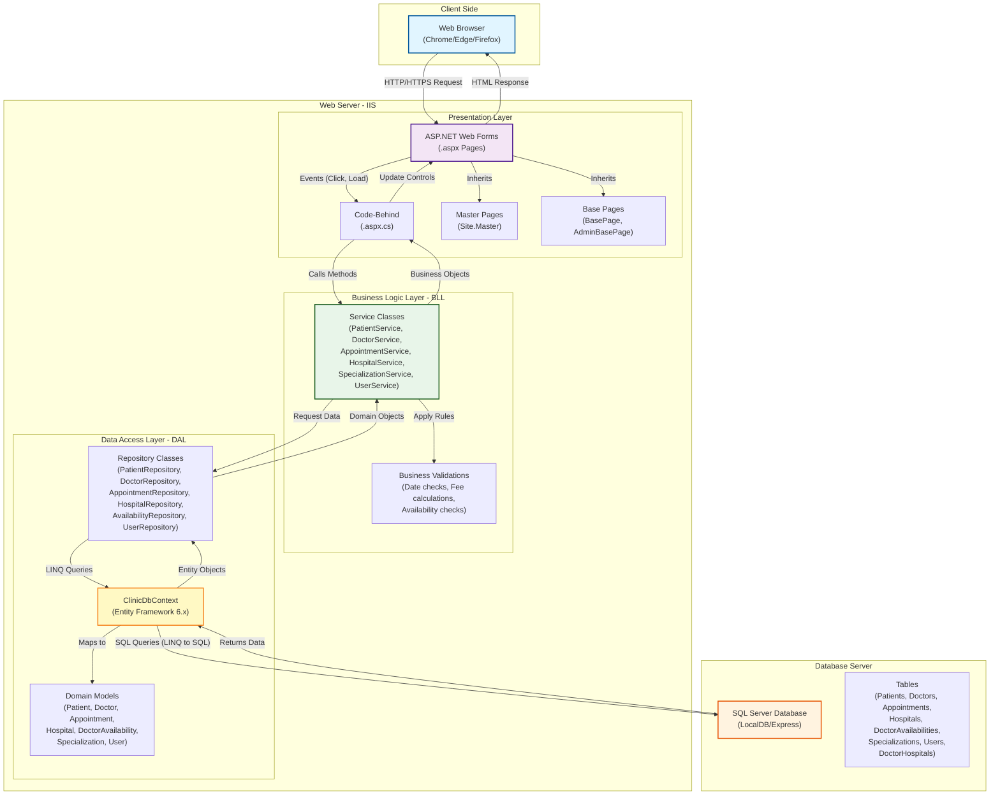
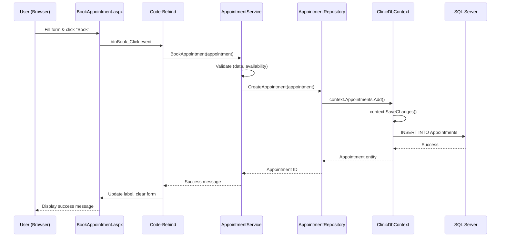
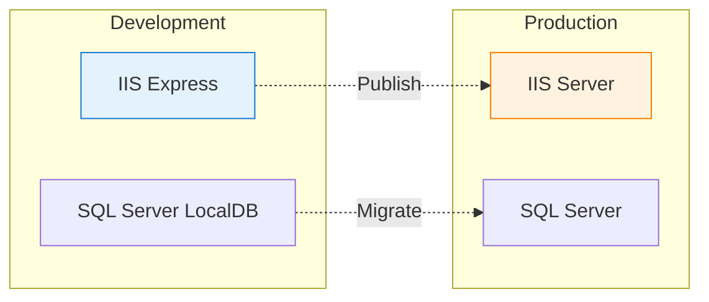

# High Level Architecture Diagram

This diagram illustrates the **N-Tier Architecture** implemented for the Durdans Hospital Clinic Management System using ASP.NET Web Forms and Entity Framework 6.x.

## System Architecture

## Detailed Component Breakdown

### 1. Presentation Layer
**Purpose**: Handles user interaction and renders HTML responses.

**Components**:
- **Web Forms Pages** (`.aspx`): UI markup with ASP.NET server controls
  - `Default.aspx` - Dashboard
  - `ManagePatient.aspx` - Patient registration and management
  - `ManageDoctors.aspx` - Doctor registration and availability
  - `ManageHospital.aspx` - Hospital management
  - `ManageSpecializations.aspx` - Specialization management
  - `BookAppointment.aspx` - Appointment booking
  - `Login.aspx`, `Register.aspx` - Authentication

- **Code-Behind Files** (`.aspx.cs`): Event handlers and UI logic
  - Handle button clicks, page load events
  - Call BLL services
  - Bind data to GridViews, DropDownLists, Repeaters

- **Master Pages**: Consistent layout and navigation
  - `Site.Master` - Main layout with header, sidebar, footer

- **Base Pages**: Shared functionality
  - `BasePage.cs` - Session management, authentication checks
  - `AdminBasePage.cs` - Admin-specific authorization

**Technologies**:
- ASP.NET Web Forms (.NET Framework 4.8)
- Bootstrap 3.x for responsive design
- jQuery for client-side interactions

---

### 2. Business Logic Layer (BLL)
**Purpose**: Contains core business rules, validations, and workflow logic.

**Service Classes**:
1. **PatientService**: Patient registration, search, update, delete
2. **DoctorService**: Doctor management, availability scheduling
3. **AppointmentService**: Appointment booking, cancellation, search
4. **HospitalService**: Hospital CRUD operations
5. **SpecializationService**: Specialization management
6. **UserService**: User authentication and management

**Responsibilities**:
- Input validation (e.g., date ranges, required fields)
- Business rule enforcement (e.g., no past appointments, doctor availability)
- Data transformation and calculations
- Orchestrating multiple repository calls
- Exception handling and error messaging

---

### 3. Data Access Layer (DAL)
**Purpose**: Abstracts database operations using Entity Framework 6.x.

**Repository Pattern**:
- **PatientRepository**: CRUD operations for patients
- **DoctorRepository**: Doctor data access with specializations
- **AppointmentRepository**: Appointment queries with filtering
- **HospitalRepository**: Hospital data management
- **AvailabilityRepository**: Doctor availability schedules
- **SpecializationRepository**: Specialization data access
- **UserRepository**: User authentication data

**ClinicDbContext**:
- Inherits from `DbContext` (Entity Framework 6.x)
- Manages `DbSet<T>` for each entity
- Configures relationships and constraints
- Handles database migrations

**Domain Models**:
1. **Patient**: Id, Name, DateOfBirth, ContactNumber, UserId
2. **Doctor**: Id, Name, SpecializationId, ConsultationFee
3. **Appointment**: Id, PatientId, DoctorId, HospitalId, AppointmentDate, Status
4. **Hospital**: Id, Name, Address
5. **DoctorAvailability**: Id, DoctorId, HospitalId, DayOfWeek, StartTime, EndTime
6. **Specialization**: Id, Name, Description, IsActive
7. **User**: Id, Username, PasswordHash, Email, Role

**Relationships**:
- Doctor ↔ Hospital: Many-to-Many (via `DoctorHospitals` junction table)
- Doctor → Specialization: Many-to-One
- Appointment → Patient, Doctor, Hospital: Many-to-One
- DoctorAvailability → Doctor, Hospital: Many-to-One
- Patient → User: One-to-One (optional)

---

### 4. Database Layer
**Purpose**: Persistent storage of all application data.

**Technology**: Microsoft SQL Server (LocalDB for development)

**Tables**:
- `Patients`, `Doctors`, `Appointments`, `Hospitals`
- `DoctorAvailabilities`, `Specializations`, `Users`
- `DoctorHospitals` (junction table for many-to-many)

**Features**:
- Entity Framework Code First migrations
- Automatic schema generation and updates
- Foreign key constraints and relationships
- Indexed columns for performance

---

## Data Flow Example: Booking an Appointment

---

## Security Implementation

### Authentication
- **Forms Authentication**: Session-based user login
- **Password Hashing**: Secure password storage (SHA256)
- **Session Management**: User state maintained in `Session["UserId"]`

### Authorization
- **Role-Based Access**: Admin vs. Patient roles
- **Page-Level Protection**: `BasePage` and `AdminBasePage` enforce access
- **URL Authorization**: Restricted folders for admin pages

### Input Validation
- **Server-Side Validators**: RequiredFieldValidator, RangeValidator, RegularExpressionValidator
- **Parameterized Queries**: Entity Framework prevents SQL injection
- **HTML Encoding**: `Server.HtmlEncode()` for output

---

## Key Architectural Decisions

### Why Entity Framework 6.x?
- **Rapid Development**: Code First approach with automatic migrations
- **Type Safety**: LINQ queries with compile-time checking
- **Maintainability**: No manual SQL for CRUD operations
- **Relationship Management**: Automatic handling of foreign keys and navigation properties

### Why Repository Pattern?
- **Separation of Concerns**: DAL isolated from BLL
- **Testability**: Easy to mock repositories for unit testing
- **Flexibility**: Can swap EF for another ORM without changing BLL

### Why N-Tier Architecture?
- **Scalability**: Each layer can be optimized independently
- **Maintainability**: Clear separation makes code easier to understand
- **Reusability**: BLL can be reused across different presentation layers
- **Team Collaboration**: Different developers can work on different layers

---

## Technology Stack Summary

| Layer | Technology | Version |
|-------|-----------|---------|
| **Presentation** | ASP.NET Web Forms | .NET Framework 4.8 |
| **UI Framework** | Bootstrap | 3.x |
| **Business Logic** | C# Classes | C# 7.3 |
| **Data Access** | Entity Framework | 6.x (Code First) |
| **Database** | SQL Server | LocalDB/Express |
| **Authentication** | Forms Authentication | Built-in |
| **Client Scripts** | jQuery | 3.x |

---

## Deployment Architecture

**Development**: 
- IIS Express (Visual Studio)
- SQL Server LocalDB
- Debug mode with detailed errors

**Production**:
- Full IIS Server (Windows Server)
- SQL Server (Standard/Enterprise)
- Release mode with custom error pages
- Connection string encryption
