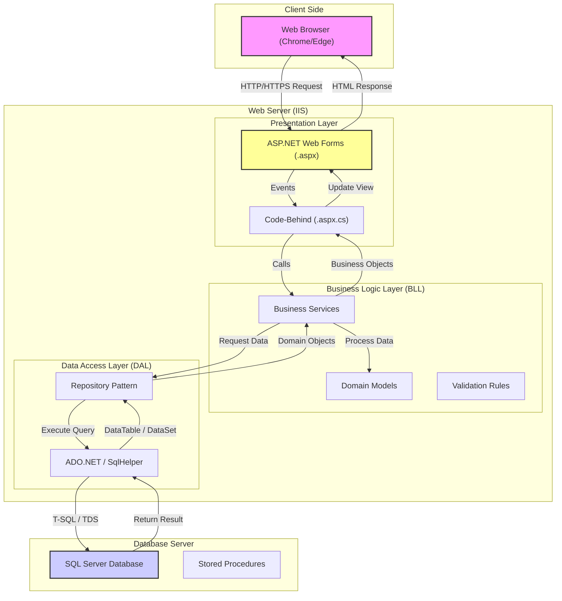

# High Level Architecture Diagram

This diagram illustrates the **N-Tier Architecture** proposed for the Durdans Hospital Clinic Management System.

## Key Components
1.  **Presentation Layer**: Handles user interaction and renders HTML.
2.  **Business Logic Layer**: Contains core business rules (e.g., checking doctor availability).
3.  **Data Access Layer**: Abstracts database interactions using ADO.NET.
4.  **Database**: SQL Server storing persistent data and business logic in Stored Procedures.
