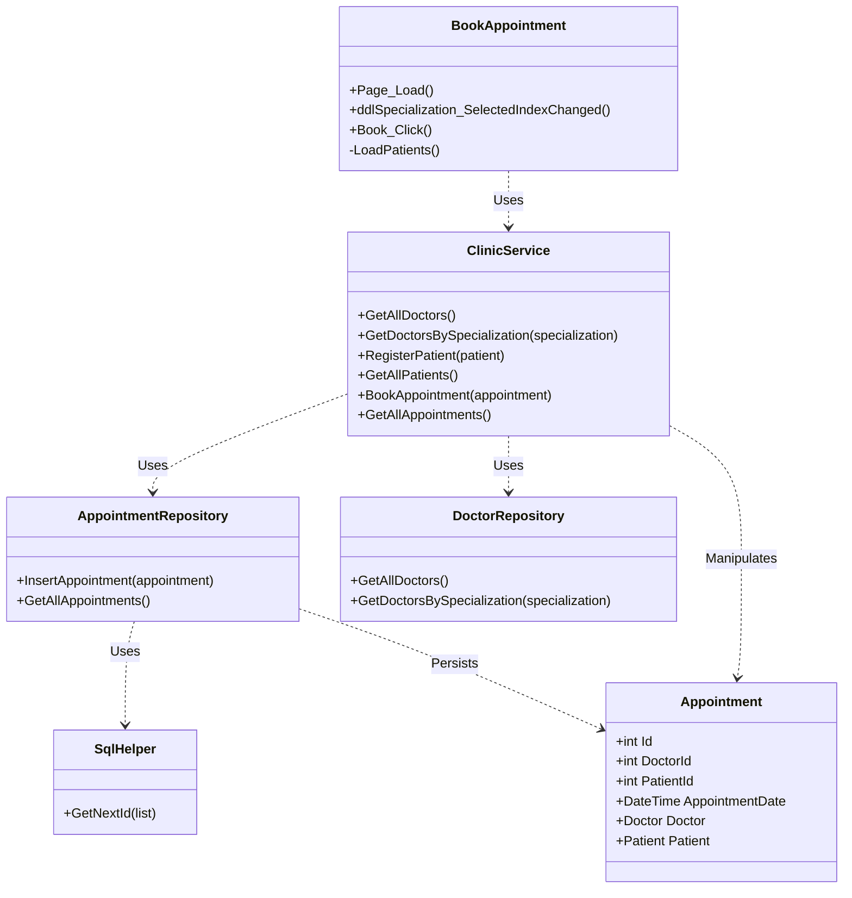
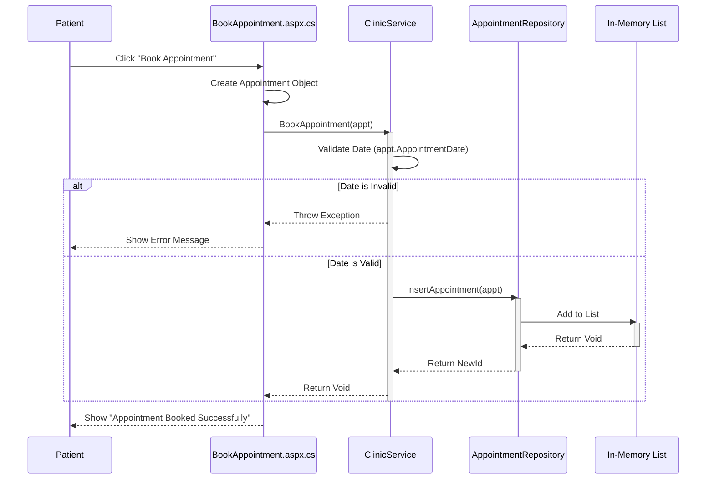
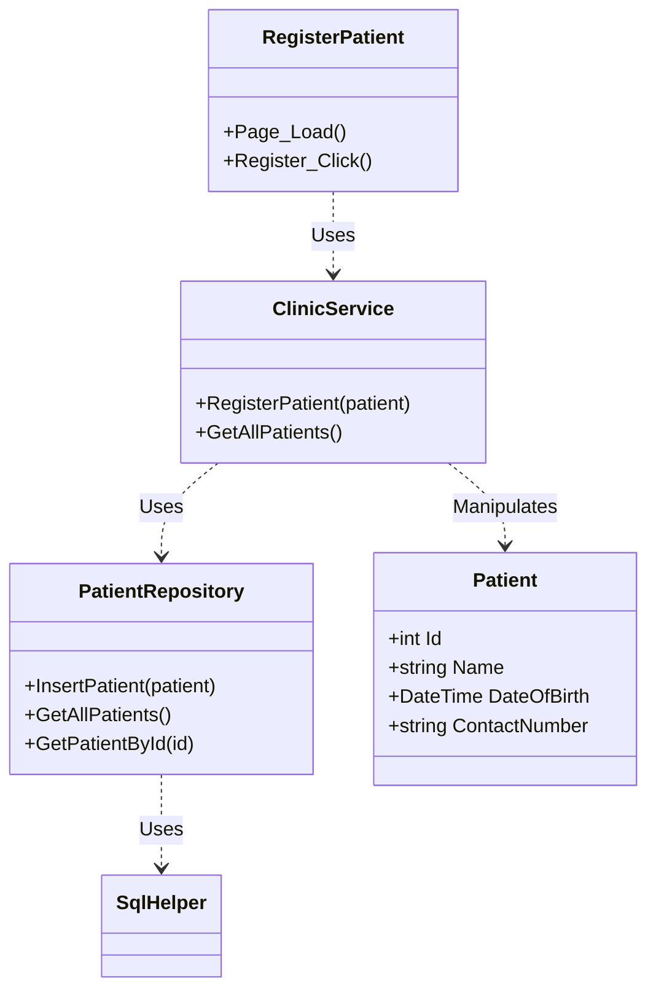
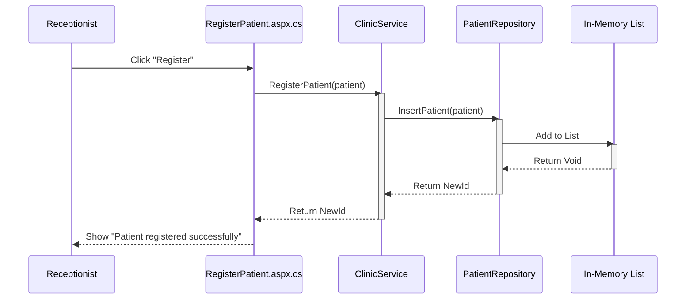

# Low Level Design Diagrams

## 1. Appointment Booking Module

### 1.1 Class Diagram
Details the classes involved in scheduling an appointment.

### 1.2 Sequence Diagram
The flow when a patient clicks "Book".

---

## 2. Patient Registration Module

### 2.1 Class Diagram
Details the classes involved in registering a new patient.

### 2.2 Sequence Diagram
The flow when a receptionist registers a new patient.

